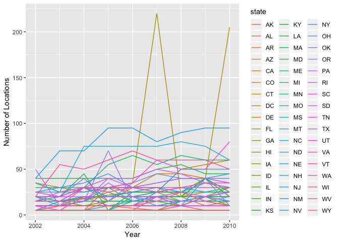
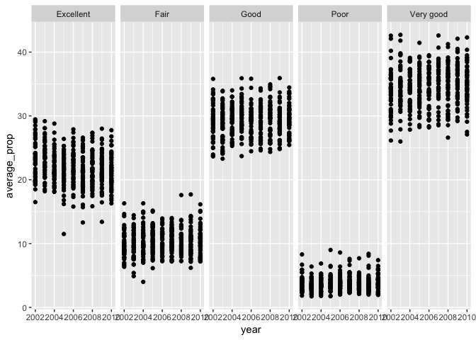
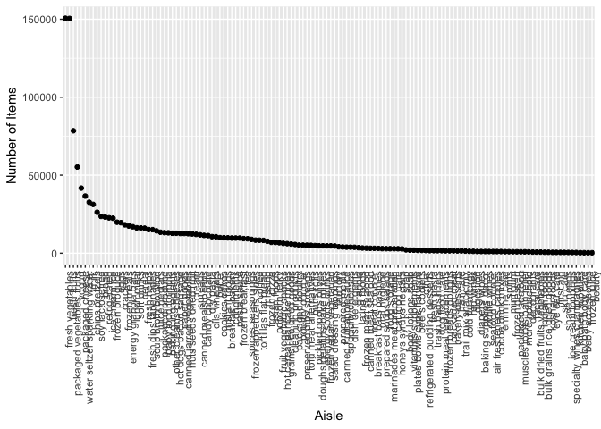

p8105\_hw3\_yw3236
================
Yishan Wang
2018-10-15

Problem 1
=========

``` r
devtools::install_github("p8105/p8105.datasets")
```

    ## Skipping install of 'p8105.datasets' from a github remote, the SHA1 (21f5ad1c) has not changed since last install.
    ##   Use `force = TRUE` to force installation

``` r
library(p8105.datasets)
data(brfss_smart2010) 
```

### Clean Data

-   Format the data to use appropriate variable names
-   Focus on the “Overall Health” topic
-   Include only responses from “Excellent” to “Poor”
-   Organize responses as a factor taking levels ordered from “Excellent” to “Poor”

``` r
formated_brfss_smart2010 = brfss_smart2010 %>%
  janitor::clean_names() %>%
  rename(., state = locationabbr, county = locationdesc) %>%
  filter(., topic == "Overall Health") %>%
  filter(., response == "Excellent" | response == "Very good" | response == "Good" | response == "Fair" | response == "Poor") %>%
  mutate(., factor(response, levels = c("Excellent", "Very good", "Good", "Fair", "Poor")))

formated_brfss_smart2010
```

    ## # A tibble: 10,625 x 24
    ##     year state county class topic question response sample_size data_value
    ##    <int> <chr> <chr>  <chr> <chr> <chr>    <chr>          <int>      <dbl>
    ##  1  2010 AL    AL - ~ Heal~ Over~ How is ~ Excelle~          94       18.9
    ##  2  2010 AL    AL - ~ Heal~ Over~ How is ~ Very go~         148       30  
    ##  3  2010 AL    AL - ~ Heal~ Over~ How is ~ Good             208       33.1
    ##  4  2010 AL    AL - ~ Heal~ Over~ How is ~ Fair             107       12.5
    ##  5  2010 AL    AL - ~ Heal~ Over~ How is ~ Poor              45        5.5
    ##  6  2010 AL    AL - ~ Heal~ Over~ How is ~ Excelle~          91       15.6
    ##  7  2010 AL    AL - ~ Heal~ Over~ How is ~ Very go~         177       31.3
    ##  8  2010 AL    AL - ~ Heal~ Over~ How is ~ Good             224       31.2
    ##  9  2010 AL    AL - ~ Heal~ Over~ How is ~ Fair             120       15.5
    ## 10  2010 AL    AL - ~ Heal~ Over~ How is ~ Poor              66        6.4
    ## # ... with 10,615 more rows, and 15 more variables:
    ## #   confidence_limit_low <dbl>, confidence_limit_high <dbl>,
    ## #   display_order <int>, data_value_unit <chr>, data_value_type <chr>,
    ## #   data_value_footnote_symbol <chr>, data_value_footnote <chr>,
    ## #   data_source <chr>, class_id <chr>, topic_id <chr>, location_id <chr>,
    ## #   question_id <chr>, respid <chr>, geo_location <chr>, `factor(response,
    ## #   levels = c("Excellent", "Very good", "Good", \n "Fair",
    ## #   "Poor"))` <fct>

### Question 1

``` r
formated_brfss_smart2010_2002 = formated_brfss_smart2010 %>%
  filter(., year == "2002") %>%
  select(., year, state, county) %>%
  unique(.) %>%
  group_by(state) %>%
  summarize(n = n())
```

In 2002, CT, FL, NC were observed at 7 locations.

### Question 2

Make a “spaghetti plot” that shows the number of locations in each state from 2002 to 2010.

``` r
plot_2002_to_2010 = formated_brfss_smart2010 %>%
  select(., year, state) %>%
  group_by(year, state) %>%
  summarize(n_location = n())

ggplot(plot_2002_to_2010, aes(x = year, y = n_location, color = state)) +
  geom_line() +
  labs(x = "Year", y = "Number of Locations")
```



``` r
plot_2002_to_2010
```

    ## # A tibble: 443 x 3
    ## # Groups:   year [9]
    ##     year state n_location
    ##    <int> <chr>      <int>
    ##  1  2002 AK             5
    ##  2  2002 AL             5
    ##  3  2002 AR             5
    ##  4  2002 AZ            10
    ##  5  2002 CA             5
    ##  6  2002 CO            20
    ##  7  2002 CT            35
    ##  8  2002 DC             5
    ##  9  2002 DE            15
    ## 10  2002 FL            35
    ## # ... with 433 more rows

There are many lines in the plot, just like "spaghetti". It's kind of difficult to read information from this plot.

### Question 3

Make a table showing, for the years 2002, 2006, and 2010, the mean and standard deviation of the proportion of “Excellent” responses across locations in NY State.

``` r
formated_brfss_smart2010_excellent_NY = formated_brfss_smart2010 %>%
  filter(., year == "2002" | year == "2006" | year == "2010") %>%
  filter(., state == "NY") %>%
  select(., year, state, county, response, data_value) %>%
  arrange(., year, county) %>%
  filter(., response == "Excellent") %>%
  group_by(year) %>%
  summarise(mean_ny_excellent = mean(data_value), std_ny_excellent = sqrt(var(data_value))) %>%
  knitr::kable(digits = 1) 

formated_brfss_smart2010_excellent_NY
```

|  year|  mean\_ny\_excellent|  std\_ny\_excellent|
|-----:|--------------------:|-------------------:|
|  2002|                 24.0|                 4.5|
|  2006|                 22.5|                 4.0|
|  2010|                 22.7|                 3.6|

From the table, we can see that year 2002 has the highest mean and standard deviation of the proportion of “Excellent” responses across locations in NY State.

### Question 4

-   For each year and state, compute the average proportion in each response category. \* Make a five-panel plot that shows, for each response category separately, the distribution of these state-level averages over time.

``` r
response_average_prop = formated_brfss_smart2010 %>%
  select(., year, state, county, response, data_value) %>%
  group_by(year, state, response) %>%
  summarise(average_prop = mean(data_value))

response_average_prop
```

    ## # A tibble: 2,215 x 4
    ## # Groups:   year, state [?]
    ##     year state response  average_prop
    ##    <int> <chr> <chr>            <dbl>
    ##  1  2002 AK    Excellent         27.9
    ##  2  2002 AK    Fair               8.6
    ##  3  2002 AK    Good              23.8
    ##  4  2002 AK    Poor               5.9
    ##  5  2002 AK    Very good         33.7
    ##  6  2002 AL    Excellent         18.5
    ##  7  2002 AL    Fair              12.1
    ##  8  2002 AL    Good              32.7
    ##  9  2002 AL    Poor               5.9
    ## 10  2002 AL    Very good         30.9
    ## # ... with 2,205 more rows

``` r
ggplot(response_average_prop, aes(x = year, y = average_prop)) +
  geom_point() +
  facet_grid(~response)
```

    ## Warning: Removed 21 rows containing missing values (geom_point).



For the **excellent** response, the average proportion of it from 2002 to 2010 is approximatelly between 15% and 30 %. For the **very good** response, the average proportion of it from 2002 to 2010 is approximatelly between 25% and 40%. For the **good** response, the average proportion of it from 2002 to 2010 is approximatelly between 25% and 35%. For the **fair** response, the average proportion of it from 2002 to 2010 is approximatelly between 5% and 15%. For the **poor** response, the average proportion of it from 2002 to 2010 is approximatelly between 0% and 10%.

Problem 2
=========

``` r
data(instacart)
```

#### Description of the Dataset

The dataset is about instacart company sale information. The size of the dataset is 1,384,617 x 15. The structure of the dataset is ready for the analysis. The key variables are `order_dow`, `order_hour_of_day`, `product_name`, `aisle`. Each observation includes custmers' information, ordered products' imformation.

### Question 1

``` r
n_aisles = nrow(instacart %>%
  select(., aisle) %>%
  unique(.))

n_aisles
```

    ## [1] 134

``` r
most_order_aisles = instacart %>%
  select(., aisle, product_id) %>%
  arrange(., aisle, product_id) %>%
  group_by(aisle) %>%
  summarise(item_num = n()) %>%
  arrange(., item_num) %>%
  tail(5)

most_order_aisles
```

    ## # A tibble: 5 x 2
    ##   aisle                      item_num
    ##   <chr>                         <int>
    ## 1 packaged cheese               41699
    ## 2 yogurt                        55240
    ## 3 packaged vegetables fruits    78493
    ## 4 fresh fruits                 150473
    ## 5 fresh vegetables             150609

There are 134 aisles there. The most items ordered from fresh vegetables aisle.

### Question 2

Make a plot that shows the number of items ordered in each aisle.

``` r
order_aisles = instacart %>%
  select(., aisle, product_id) %>%
  arrange(., aisle, product_id) %>%
  group_by(aisle) %>%
  summarise(item_num = n()) %>%
  arrange(., desc(item_num))

ggplot(order_aisles, aes(x = reorder(aisle, -item_num), y = item_num)) +  
  geom_point() +
  theme(axis.text.x = element_text(angle = 90, hjust = 1, size = rel(1))) +
  labs(x = "Aisle", y = "Number of Items")
```



``` r
order_aisles
```

    ## # A tibble: 134 x 2
    ##    aisle                         item_num
    ##    <chr>                            <int>
    ##  1 fresh vegetables                150609
    ##  2 fresh fruits                    150473
    ##  3 packaged vegetables fruits       78493
    ##  4 yogurt                           55240
    ##  5 packaged cheese                  41699
    ##  6 water seltzer sparkling water    36617
    ##  7 milk                             32644
    ##  8 chips pretzels                   31269
    ##  9 soy lactosefree                  26240
    ## 10 bread                            23635
    ## # ... with 124 more rows

Since there are too many aisles in the x axis, I choose to order the `item_num` as decending order and adjust the theme of the graph, such as set the angle is 90. From the graph, we can see that there are few items that has really high number of items. The number of items of the majority of aisles is under 50000.

### Question 3

Make a table showing the most popular item in each of the aisles “baking ingredients”, “dog food care”, and “packaged vegetables fruits”.

``` r
popular_aisles = instacart %>%
  select(., aisle, product_id, product_name) %>%
  filter(., aisle == "baking ingredients" | aisle == "dog food care" | aisle == "packaged vegetables fruits") %>%
  arrange(., aisle, product_id) %>%
  group_by(aisle, product_id, product_name) %>%
  summarise(item_num = n())
  
popular_bi_item = popular_aisles %>%
  filter(., aisle == "baking ingredients") %>%
  arrange(., item_num) %>%
  tail(1)

popular_dfc_item = popular_aisles %>%
  filter(., aisle == "dog food care") %>%
  arrange(., item_num) %>%
  tail(1)

popular_pvf_item = popular_aisles %>%
  filter(., aisle == "packaged vegetables fruits") %>%
  arrange(., item_num) %>%
  tail(1)

tibble(
  ailse = c("baking ingredients", "dog food care", "packaged vegetables fruits"),
  popular_item = c(popular_bi_item$product_name, popular_dfc_item$product_name, popular_pvf_item$product_name)
) %>%
  knitr::kable(digits = 1) 
```

| ailse                      | popular\_item                                 |
|:---------------------------|:----------------------------------------------|
| baking ingredients         | Light Brown Sugar                             |
| dog food care              | Snack Sticks Chicken & Rice Recipe Dog Treats |
| packaged vegetables fruits | Organic Baby Spinach                          |

By looking at the table, we can find the most poplular items in each aisle mentioned above. We can see that light brown sugar is the most popular ingredients. Dog owners love Snack Sticks Chicken & Rice Recipe Dog Treats. The most popular vegetable is organic baby spinach. From the table, the company can buy more those popular items for sale.
